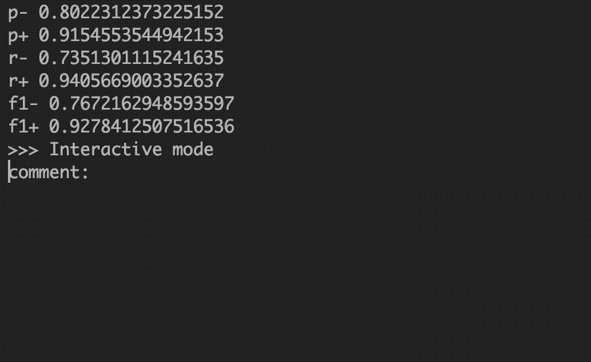

# digikala-sentiment-lstm
> 🧠Trains a simple LSTM model on the Digikala sentiment classification task




## Installation
Install `python` and `pip`. Create a `virtualenv` and activate it. Then:

```bash
$ git clone https://github.com/rajabzz/digikala-sentiment-lstm.git
$ cd digikala-sentiment-lstm
$ mkdir data
$ mkdir models
$ pip install -r requirements.txt
```
Copy your dataset to `data` folder. If you don't have any dataset, consider using [digikala-crawler](https://github.com/rajabzz/digikala-crawler).

## Running The Program
The following command preprocesses the data, trains the LSTM model, evaluates it and starts an interactive mode for user's manual inputs:
```bash
$ python main.py
```
You can read preprocessed data or use pretrained model by changing corresponding variables in `main.py` file.

## License
This project is licensed under the MIT License - see the [LICENSE](LICENSE) file for details

## Task List
- [ ] Split the code into multiple files.
- [ ] Use `sys.argv` instead of manually changing the variables inside the code.
